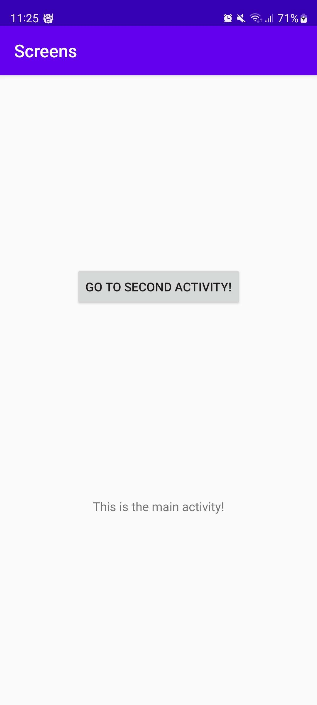
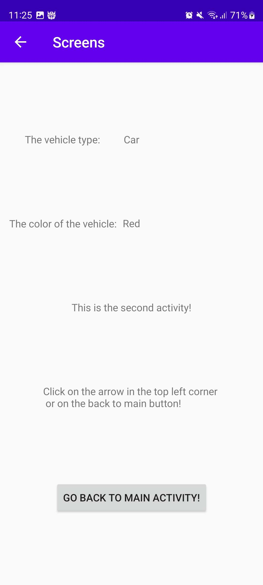

# Rapport

Jag har lagt till en second activity med information om fordons-typ och fordons-färg.
Informationen om fordonet skickas från main activity till second activity via intent.
Jag har även gjort så man kan gå emellan de olika aktiviteterna via knappar.

## Följande grundsyn gäller dugga-svar:

Koden nedan skickar information via intent till second activity. 

```
buttonToSecondActivity.setOnClickListener(new View.OnClickListener() {
    @Override
    public void onClick(View view) {
        Intent intent = new Intent(MainActivity.this, SecondActivity.class);
        intent.putExtra("vehicle", "Car");
        intent.putExtra("color", "Red");
        startActivity(intent);
    }
});
```

Koden nedan tar in informationen som skickades från main activity via intent och sätter
in den i två olika textviews.

```
Bundle extras = getIntent().getExtras();
if (extras != null) {
    String vehicle = extras.getString("vehicle");
    String color = extras.getString("color");
    vehicleText.setText(vehicle);
    colorText.setText(color);
}
```

MainActivity:


SecondActivity:
